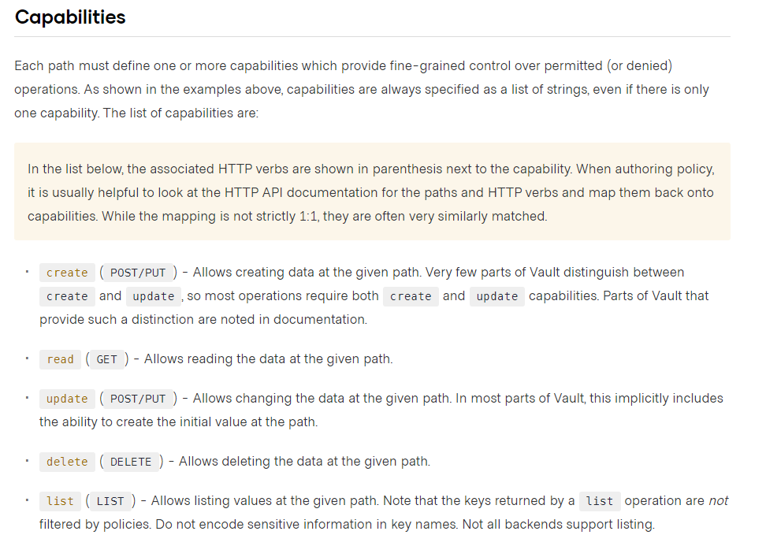

Policy documents in Vault are created using HCL formatted documents, in their most basic form they contain
the path of the resource to which the policy applies, and the access level for that resource.

The following example would provide `read` access to the `api` secrets that you created earlier.

```ruby
path "secret/data/api" {
  capabilities = ["read"]
}
```

## Creating policy

To write a policy you can use the CLI specifying either a file or using heredoc:

```shell
cat << EOF | vault policy write api -
path "secret/data/api" {
  capabilities = ["read"]
}
EOF
```

<p><Terminal target="tools.container.shipyard.run" shell="/bin/bash" workdir="/files" user="root" /></p>

## Testing policy

For this policy to enforce access it needs to be attached to a Vault token, normally a Vault token is obtained
through authenticating with Vault using an auth method like JWT. However, to test policy you can also
generate a token directly using the Vault CLI. Let's try that to see the policy in action.

If you run the following command in the terminal

```shell
vault token create -policy api
```

<p><Terminal target="tools.container.shipyard.run" shell="/bin/bash" workdir="/files" user="root" /></p>

You should see some output that looks like the following:

```shell
Key                  Value
---                  -----
token                hvs.CAESIH7_BPDUeECIRyzkApHOlN-YU9f0OHtKXgtkPaqE42tbGh4KHGh2cy5EelM3VHJ1Wm9QN3ZRSkJ6MEFGZ2ZwdnQ
token_accessor       mMo1vY2jTH3OKimQy3zz6atg
token_duration       768h
token_renewable      true
token_policies       ["api" "default"]
identity_policies    []
policies             ["api" "default"]

```

Let's test the policy, first you need to set the token replacing the root token that the current terminal is using, remember to 
replace the token string in the command with the value returned from your `token create` command. 

```shell
export VAULT_TOKEN=hvs.CAESIH7_BPDUeECIRyzkApHOlN-YU9f0OHtKXgtkPaqE42tbGh4KHGh2cy5EelM3VHJ1Wm9QN3ZRSkJ6MEFGZ2ZwdnQ
```

<p><Terminal target="tools.container.shipyard.run" shell="/bin/bash" workdir="/files" user="root" /></p>

Now try to read the api secret

```shell
vault kv get secret/api
```

This should work fine and you should see the following output

```shell
= Secret Path =
secret/data/api

======= Metadata =======
Key                Value
---                -----
created_time       2022-04-18T07:32:39.183844647Z
custom_metadata    <nil>
deletion_time      n/a
destroyed          false
version            3

===== Data =====
Key        Value
---        -----
api_key    abcdefg
```

However if you try to update the secret:

```shell
vault kv put secret/api api_key=123456
```

Vault should return you an error message as the `api` policy does not allow you access to perform this operation

```shell
Error writing data to secret/data/api: Error making API request.

URL: PUT http://127.0.0.1:8200/v1/secret/data/api
Code: 403. Errors:

* 1 error occurred:
        * permission denied
```

## Updating policy

Let's quickly update this policy to add update capability, the full list of capabilities for vault policy is shown below, we
are going to add the `update` capability.

[https://www.vaultproject.io/docs/concepts/policies#capabilities](https://www.vaultproject.io/docs/concepts/policies#capabilities)


Run the following command in the terminal below to update your policy

```shell
cat << EOF | vault policy write api -
path "secret/data/api" {
  capabilities = ["read","update"]
}
EOF
```

<p><Terminal target="tools.container.shipyard.run" shell="/bin/bash" workdir="/files" user="root" /></p>

Again you will need to set the Vault token that you obtained in a previous step as by default the terminal has been configured
to use root permissions.

```shell
export VAULT_TOKEN=hvs.CAESIH7_BPDUeECIRyzkApHOlN-YU9f0OHtKXgtkPaqE42tbGh4KHGh2cy5EelM3VHJ1Wm9QN3ZRSkJ6MEFGZ2ZwdnQ
```

When you now try to update the secret you will see that the operation succeeds as the policy now has the `update permission.

```shell
vault kv put secret/api api_key=123456
```

You will see output that looks like the following:

```shell
= Secret Path =
secret/data/api

======= Metadata =======
Key                Value
---                -----
created_time       2022-04-18T10:15:18.432020222Z
custom_metadata    <nil>
deletion_time      n/a
destroyed          false
version            4
```

Now that we have taken a brief overview of policy, let's look at authentication.